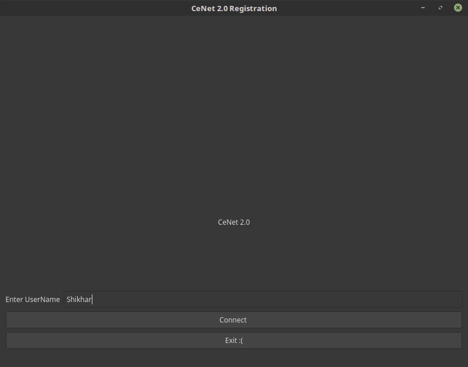
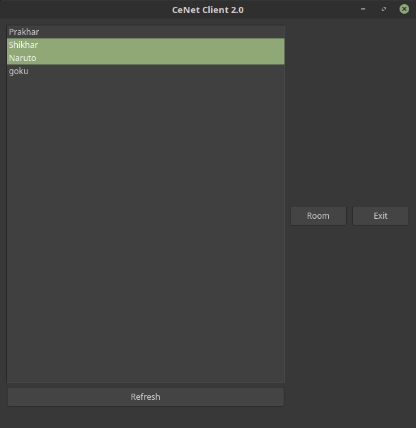
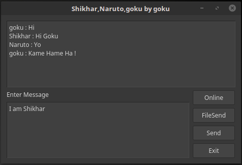
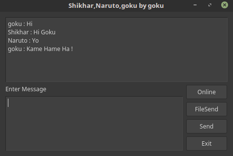

# CeNet-Interconnect

How exciting would it be if you could just connect all the computers in the college together.

Aren't they already connected through LAN ?  
Well they are connected to each other, but then there are different LAN networks in our college.
You can see it as different groups of smaller networks.

How would share data between KBH and AGH ?  
Well you can't do that (without of course a pendrive).

So what is CeNet ?  
CeNet is a client server application that lets you do what you have been doing with a pendrive till now.  Well we have such a large network of wires running around the college, why not use them instead of always carrying a pendrive. CeNet client lets you share data between any set of computers throughtout the college using the central college server as relay.

How do I install it ?  
Well, the project has lot of scope for developement, but at this stage you can install it as- 

- Install python3
- Install PyQt5 package
- Get the source code at save it in a directory
- open the directory
- type python3 Main.py

How do I use it ?  
Once you run it successfully, you'll see the regsitration window  
 
Yo have to simply enter your desired username and you'll be known by that username in the network.
Any wrong step and appropriate error message will be displayed.

After successful registration you'll see the client window  
  
You can see all the users currently online on CeNet.  
You can request the list of online users by clicking Refresh button, although the list refreshes every 5 second.
You can select multiple users and click the Room button to enter in a private room with them.  
Once you enter the room, everybody will be informed that you created a new room and every person in the room will have a new data sharing window popup  
 The popup window on Shikhar's computer  
 The popup window on Naruto's computer  
 The popup window on goku's computer  

All users can freely chat.  
To share files with everybody in the room -
- Bring the file in the current directory (Directory in which Main.py is running)
- Enter the file name correctly in the chat box
- Click File Send button
- All information will be displayed in the chatbox
- Dont close the window until file send complete signal is displayed
- You can simultaneously chat in the room as well, but it will lag a bit due to use of single channel to limit number of used sockets.

To go see the online window again click Online Button.  
To exit the room click the Exit Button.

